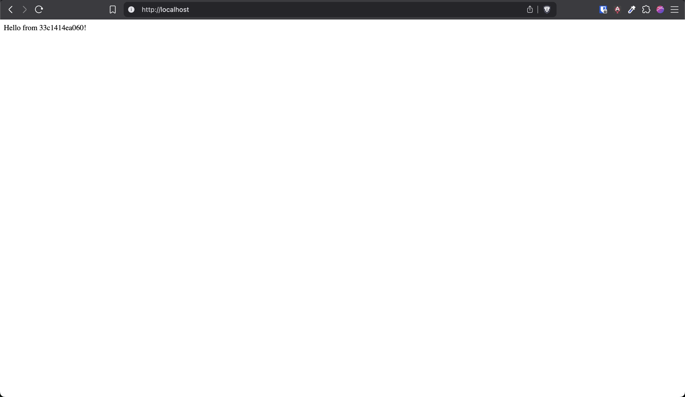
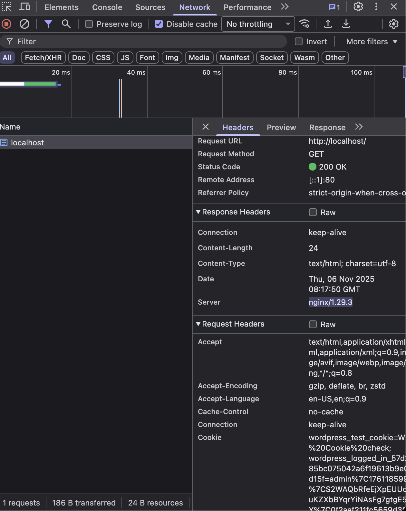
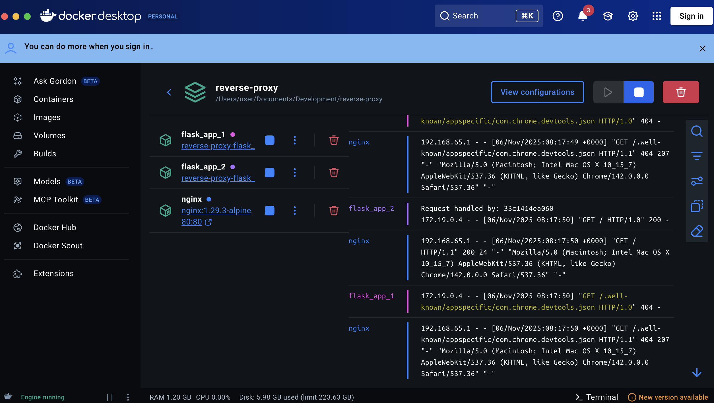

## 🌀 Reverse Proxy with Flask and Nginx (Docker Compose)

This repository demonstrates how to deploy a Flask web application behind an Nginx reverse proxy using Docker Compose.
It serves as a simple yet practical example of how reverse proxies are integrated into production-like web server deployments.

### 🚀 Features

- 🧩 Flask Backend — lightweight Python web server

- 🌐 Nginx Reverse Proxy — handles client requests and forwards them to Flask

- 🐳 Docker Compose — orchestrates multi-container deployment

- 🔁 Port Mapping — external access through Nginx proxy

- 🧱 Scalable Setup — easy to extend with additional services or microservices

### 🧠 Overview

A reverse proxy sits in front of your backend web servers.
In this setup:

- Clients interact only with Nginx (port 80)

- Nginx forwards incoming requests to the Flask container

- Flask processes the request and returns the response through Nginx

### This structure improves:

- Security (backend not directly exposed)

- Load balancing

- Maintainability and scalability

### Requirements:

You need to have docker installed on your machine.

### Usage:

1. Run docker compose

    ```bash
    docker compose build -d --build
    ```

2. Open your browser to port 80: http://localhost

3. Try refreshing the site and you'll notice that the `HOSTNAME` keeps changing, indicating that the load balancer works.

4. Check dev tools and verify that it is using `nginx` as server instead of `python`.

4. If you want to close the containers, do the command below:

    ```bash
    docker compose down
    ```

### Screenshots






